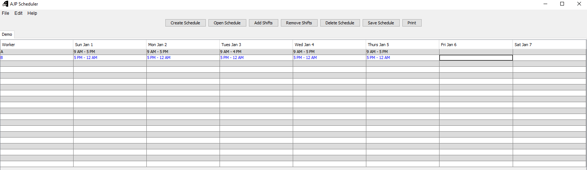

# AJP-scheduler

## Concept

A spreadsheet creator meant to store work schedules of employees.

## Usage

### Installation

Execute ```Setup.exe``` and follow the setup wizard.

A folder containing the program will be created in the same directory as ```Setup.exe```.

### Creating a schedule

Click on ```Create Schedule```, enter the name of the schedule and the starting date. A designated tab for that schedule will appear.

### Opening a schedule

Click on ```Open Schedule```. A file explorer will appear for the designated ```saves``` folder bundled with the program. Files with extension ```ajp``` are openable.

### Adding shifts

Click on ```Add Shifts``` and enter the number of shifts to add. A row for each shift will be added to the spreadsheet.

### Removing shifts

Highlight the rows containing the shifts to remove, then click ```Remove Shifts```. The selected rows will be deleted from the spreadsheet.

### Deleting a schedule

Click on ```Delete Schedule``` to delete the spreadsheet contained within the currently selected tab.

### Saving a schedule

Click on ```Save Schedule``` to save the currently selected spreadsheet as a file with extension ```ajp``` in the ```saves``` folder.

### Printing a schedule

Click on ```Print``` to open a printing dialog to specify the printing options. Printing to PDF is supported.

## Demo Image


